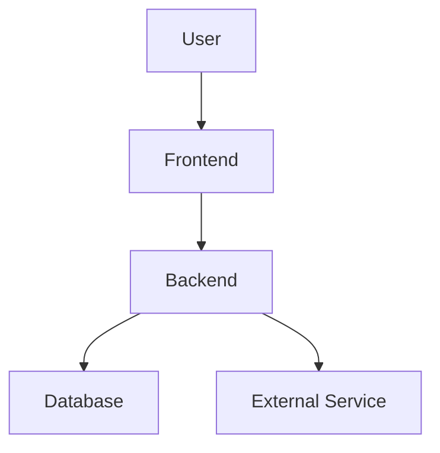

<!--
============================================================
  README TEMPLATE — replace/remove placeholders as needed
  Sections are marked CORE / OPTIONAL / ADVANCED.
  Delete anything that doesn't apply to your project.
============================================================
-->

<!-- ============ CORE: HERO / HEADER ============ -->

<!-- OPTIONAL: Theme-aware banner (shows a different image for light/dark GitHub theme) -->
<picture>
  <source media="(prefers-color-scheme: dark)" srcset="[DARK IMAGE URL]">
  <source media="(prefers-color-scheme: light)" srcset="[LIGHT IMAGE URL]">
  
</picture>

# [PROJECT NAME]

**[SHORT TAGLINE]**

[ONE-SENTENCE DESCRIPTION]

<!-- OPTIONAL: badges — only include ones that are real and wired up -->
[BUILD STATUS] [LICENSE] [VERSION] [LANGUAGE] [STATUS]

[Live Demo]([URL]) · [Documentation]([URL]) · [Repository]([URL])

---

<!-- OPTIONAL: Quick navigation — internal links to sections below -->
[Overview](#one-minute-overview) · [Features](#feature-showcase) · [Demo](#screenshot--product-tour) · [Architecture](#architecture) · [Setup](#getting-started) · [Usage](#usage) · [Testing](#testing)

<br>

<!-- ============ CORE: PROJECT SNAPSHOT ============ -->

## Project Snapshot

|                       |                    |
| --------------------- | ------------------ |
| **Type**               | [PROJECT TYPE]     |
| **Status**             | [STATUS]           |
| **Version**            | [VERSION]          |
| **Frontend**           | [TECHNOLOGY]       |
| **Backend**            | [TECHNOLOGY]       |
| **Database**           | [TECHNOLOGY]       |
| **Primary Language**   | [LANGUAGE]         |
| **License**            | [LICENSE]          |

<br>

## One-Minute Overview

**Problem**
[PROBLEM]

**Solution**
[SOLUTION]

**Users**
[TARGET USERS]

**Result**
[WHAT THE PROJECT ENABLES]

<br>

<!-- ============ CORE: WHY THIS PROJECT ============ -->

## Why This Project?

> [SHORT PROJECT MOTIVATION]

- [Problem noticed]
- [Reason for building it]
- [What you wanted to explore]
- [What makes the project interesting]

<br>

<!-- ============ CORE: FEATURE SHOWCASE ============ -->

## Feature Showcase

### [FEATURE NAME]
[DESCRIPTION]

### [FEATURE NAME]
[DESCRIPTION]

### [FEATURE NAME]
[DESCRIPTION]

<details>
<summary><strong>All capabilities</strong></summary>

| Capability  | Description   |
| ----------- | -------------- |
| [FEATURE]   | [DESCRIPTION]  |
| [FEATURE]   | [DESCRIPTION]  |
| [FEATURE]   | [DESCRIPTION]  |

</details>

<br>

<!-- OPTIONAL: "At a glance" quick-fact block. Prefer the table if the ASCII box renders oddly on your profile. -->
<details>
<summary><strong>At a glance</strong> (optional block)</summary>

```text
┌─────────────────────────────────────┐
│ [KEY FACT]        [KEY FACT]        │
│ [KEY FACT]        [KEY FACT]        │
└─────────────────────────────────────┘
```

Markdown-table alternative:

| Fact        | Value       |
| ----------- | ----------- |
| [KEY FACT]  | [VALUE]     |
| [KEY FACT]  | [VALUE]     |

</details>

<br>

<!-- ============ CORE: SCREENSHOTS / DEMO ============ -->

## Screenshot / Product Tour

![Main interface - [DESCRIPTION]]([IMAGE URL])

### [SCREEN / FEATURE NAME]
[IMAGE]
[SHORT EXPLANATION]

### [SCREEN / FEATURE NAME]
[IMAGE]
[SHORT EXPLANATION]

<!-- OPTIONAL: Add a short GIF demonstrating the main workflow -->


<!-- OPTIONAL: Video demo -->
### Demo Video
[VIDEO / YOUTUBE / DEMO LINK]
[WHAT THE VIDEO SHOWS]

<br>

<!-- ============ CORE: HOW IT WORKS ============ -->

## How It Works

```text
[INPUT]
   ↓
[PROCESSING]
   ↓
[CORE LOGIC]
   ↓
[DATA / SERVICE]
   ↓
[OUTPUT]
```

<br>

<!-- ============ OPTIONAL: ARCHITECTURE ============ -->

## Architecture

```text
[CLIENT]
   │
   ▼
[FRONTEND]
   │
   ▼
[API / BACKEND]
   │
   ├──► [SERVICE]
   │
   ├──► [PROCESSING]
   │
   └──► [DATABASE]
```

<!-- OPTIONAL: Mermaid diagram (renders natively on GitHub) -->


### Architecture Notes
- [COMPONENT] — [RESPONSIBILITY]
- [COMPONENT] — [RESPONSIBILITY]
- [COMPONENT] — [RESPONSIBILITY]

<br>

<!-- OPTIONAL: DATA FLOW — for projects that process/transform data -->
## Data Flow

```text
[DATA SOURCE]
      ↓
[VALIDATION]
      ↓
[PROCESSING]
      ↓
[TRANSFORMATION]
      ↓
[STORAGE / MODEL]
      ↓
[OUTPUT]
```

**Input:** [INPUT]
**Transformation:** [TRANSFORMATION]
**Output:** [OUTPUT]

<br>

<!-- ============ CORE: TECH STACK ============ -->

## Tech Stack

| Layer    | Technology   | Purpose   |
| -------- | ------------ | --------- |
| Language | [TECHNOLOGY] | [PURPOSE] |
| Frontend | [TECHNOLOGY] | [PURPOSE] |
| Backend  | [TECHNOLOGY] | [PURPOSE] |
| Database | [TECHNOLOGY] | [PURPOSE] |
| API      | [TECHNOLOGY] | [PURPOSE] |
| Testing  | [TECHNOLOGY] | [PURPOSE] |
| Tooling  | [TECHNOLOGY] | [PURPOSE] |

<details>
<summary>Additional categories (optional)</summary>

| Category         | Technology   | Purpose   |
| ----------------- | ------------ | --------- |
| Infrastructure     | [TECHNOLOGY] | [PURPOSE] |
| Deployment         | [TECHNOLOGY] | [PURPOSE] |
| Authentication     | [TECHNOLOGY] | [PURPOSE] |
| Data Processing    | [TECHNOLOGY] | [PURPOSE] |
| ML / NLP           | [TECHNOLOGY] | [PURPOSE] |
| Visualization      | [TECHNOLOGY] | [PURPOSE] |

</details>

<br>

<!-- ============ ADVANCED: TECHNOLOGY DECISIONS ============ -->
<details>
<summary><strong>Technology Decisions</strong> (advanced, optional)</summary>

### [TECHNOLOGY / DECISION]
**Why:** [REASON]
**Alternative considered:** [ALTERNATIVE]
**Trade-off:** [TRADE-OFF]

### [TECHNOLOGY / DECISION]
**Why:** [REASON]
**Alternative considered:** [ALTERNATIVE]
**Trade-off:** [TRADE-OFF]

</details>

<br>

<!-- ============ CORE: PROJECT STRUCTURE ============ -->

## Project Structure

```text
[PROJECT]/
├── [FOLDER]/
│   ├── [FILE]
│   └── [FILE]
├── [FOLDER]/
├── [CONFIG]
├── [DEPENDENCIES]
└── README.md
```

- `[FOLDER]/` — [WHAT IT CONTAINS]
- `[FOLDER]/` — [WHAT IT CONTAINS]

<br>

<!-- ============ OPTIONAL: API SECTION ============ -->

## API Reference

| Method   | Endpoint    | Purpose   | Auth      |
| -------- | ----------- | --------- | --------- |
| `[GET]`  | `[/endpoint]` | [PURPOSE] | [YES/NO] |
| `[POST]` | `[/endpoint]` | [PURPOSE] | [YES/NO] |

**Request**
```json
{
  "[FIELD]": "[VALUE]"
}
```

**Response**
```json
{
  "[FIELD]": "[VALUE]"
}
```

<br>

<!-- ============ ADVANCED: DATABASE / DATA MODEL ============ -->
<details>
<summary><strong>Database / Data Model</strong> (advanced, optional)</summary>

```text
[ENTITY]
├── [FIELD]
├── [FIELD]
└── [FIELD]
```

| Entity   | Purpose       |
| -------- | -------------- |
| [ENTITY] | [DESCRIPTION]  |
| [ENTITY] | [DESCRIPTION]  |

</details>

<br>

<!-- ============ CORE: GETTING STARTED ============ -->

## Getting Started

### Prerequisites
- [REQUIREMENT]
- [REQUIREMENT]

### Installation
```bash
git clone [REPOSITORY URL]
cd [PROJECT DIRECTORY]
[INSTALL COMMAND]
```

### Configuration
```env
[VARIABLE]=[VALUE]
[VARIABLE]=[VALUE]
```

### Run
```bash
[RUN COMMAND]
```

<br>

## Usage

1. [STEP]
2. [STEP]
3. [STEP]
4. [STEP]

<br>

<!-- ============ OPTIONAL: EXAMPLE ============ -->

## Example

```text
Input:
[INPUT]

↓ Processing:
[PROCESS]

↓ Output:
[OUTPUT]
```

<!-- OPTIONAL: CLI/API example -->
```bash
curl -X [METHOD] "[URL]" \
  -H "[HEADER]" \
  -d '[REQUEST]'
```

Response:
```json
{
  "[FIELD]": "[VALUE]"
}
```

<br>

<!-- ============ CORE: TESTING ============ -->

## Testing

```bash
[TEST COMMAND]
```

**Test areas**
- [AREA]
- [AREA]
- [AREA]

<br>

<!-- ============ ADVANCED: EDGE CASES ============ -->
<details>
<summary><strong>Edge Cases</strong> (advanced, optional)</summary>

| Case        | Expected Behaviour |
| ----------- | -------------------- |
| [EDGE CASE] | [BEHAVIOUR]          |
| [EDGE CASE] | [BEHAVIOUR]          |

</details>

<br>

<!-- ============ ADVANCED: PERFORMANCE ============ -->
<details>
<summary><strong>Performance Notes</strong> (advanced, optional — never insert fabricated numbers)</summary>

**Metric:** [METRIC]
**Measurement:** [VALUE]
**Environment:** [ENVIRONMENT]
**Method:** [HOW IT WAS MEASURED]

</details>

<br>

<!-- ============ OPTIONAL: SECURITY ============ -->

## Security Considerations
- [MECHANISM]
- [MECHANISM]
- [MECHANISM]

<br>

<!-- ============ ADVANCED: ACCESSIBILITY ============ -->
<details>
<summary><strong>Accessibility</strong> (advanced, optional)</summary>

- [ACCESSIBILITY FEATURE]
- [ACCESSIBILITY FEATURE]
- [ACCESSIBILITY FEATURE]

Meaningful `alt` text example:
```html

```

</details>

<br>

<!-- ============ OPTIONAL: PLATFORM SUPPORT ============ -->

## Platform Support

| Platform   | Status   |
| ---------- | -------- |
| [PLATFORM] | [STATUS] |
| [PLATFORM] | [STATUS] |

<br>

<!-- ============ CORE: LIMITATIONS ============ -->

## Limitations
- [LIMITATION]
- [LIMITATION]
- [LIMITATION]

<!-- OPTIONAL: known issues table -->
<details>
<summary>Known Issues</summary>

| Issue   | Status       | Notes   |
| ------- | ------------ | ------- |
| [ISSUE] | [OPEN/FIXED] | [NOTES] |

</details>

<br>

<!-- ============ CORE: ROADMAP ============ -->

## Roadmap

```text
[x] [COMPLETED]
[x] [COMPLETED]
[ ] [NEXT]
[ ] [PLANNED]
```

**Now** — [ITEM]
**Next** — [ITEM]
**Later** — [ITEM]

<br>

<!-- ============ ADVANCED: CHANGELOG ============ -->
<details>
<summary><strong>Changelog</strong> (advanced, optional — or keep this in a separate CHANGELOG.md if the project grows)</summary>

### [VERSION] — [DATE]
- [CHANGE]
- [CHANGE]

### [VERSION] — [DATE]
- [CHANGE]

</details>

<br>

<!-- ============ OPTIONAL: CONTRIBUTING ============ -->

## Contributing

1. [Fork / branch instructions]
2. [Development instructions]
3. [Testing]
4. [Pull request expectations]

See [CONTRIBUTING.md]([LINK]) for details.

<!-- OPTIONAL: development workflow diagram -->
<details>
<summary>Development workflow</summary>

```text
Issue
  ↓
Branch
  ↓
Development
  ↓
Testing
  ↓
Pull Request
  ↓
Review
  ↓
Merge
```

</details>

<br>

<!-- ============ ADVANCED: RELEASES ============ -->
<details>
<summary>Releases</summary>

| Version   | Date   | Highlights |
| --------- | ------ | ---------- |
| [VERSION] | [DATE] | [CHANGE]   |

</details>

<br>

<!-- ============ OPTIONAL: SUPPORT ============ -->

## Support

Found a problem or have a question? [SUPPORT METHOD]

- Documentation: [LINK]
- Issues: [LINK]
- Discussions: [LINK]
- Contact: [EMAIL]

<br>

<!-- ============ OPTIONAL: FAQ ============ -->

## FAQ

<details>
<summary>What is [PROJECT NAME]?</summary>

[ANSWER]

</details>

<details>
<summary>[QUESTION]</summary>

[ANSWER]

</details>

<details>
<summary>[QUESTION]</summary>

[ANSWER]

</details>

<br>

<!-- ============ OPTIONAL: TROUBLESHOOTING ============ -->

## Troubleshooting

<details>
<summary>[COMMON PROBLEM]</summary>

[CAUSE]

**Solution:** [SOLUTION]

</details>

<br>

<!-- ============ ADVANCED: BENCHMARKS ============ -->
<details>
<summary><strong>Benchmarks / Comparison</strong> (advanced, optional — only if you have real, measured results)</summary>

| Approach   | Metric   | Result   |
| ---------- | -------- | -------- |
| [APPROACH] | [METRIC] | [RESULT] |
| [APPROACH] | [METRIC] | [RESULT] |

</details>

<br>

<!-- ============ CORE: LEARNINGS / CHALLENGES ============ -->

## What I Learned
- [LESSON]
- [LESSON]
- [LESSON]

### Challenges & Solutions

| Challenge   | Approach   |
| ----------- | ---------- |
| [CHALLENGE] | [SOLUTION] |
| [CHALLENGE] | [SOLUTION] |

<!-- OPTIONAL: engineering highlights -->
<details>
<summary>Engineering Highlights</summary>

- [TECHNICAL HIGHLIGHT]
- [TECHNICAL HIGHLIGHT]
- [TECHNICAL HIGHLIGHT]

</details>

<br>

<!-- ============ ADVANCED: PROJECT METRICS ============ -->
<details>
<summary>Project Metrics (optional — real numbers only, e.g. via cloc)</summary>

- Lines of code: `[LINES OF CODE]`
- Modules: `[NUMBER OF MODULES]`
- Tests: `[NUMBER OF TESTS]`
- Endpoints: `[NUMBER OF ENDPOINTS]`

</details>

<!-- ============ ADVANCED: REPOSITORY HEALTH ============ -->
<details>
<summary>Repository Health (optional — only real, wired-up badges)</summary>

`[CI]` `[TESTS]` `[LICENSE]` `[SECURITY]`

</details>

<br>

<!-- ============ ADVANCED: CITATION ============ -->
<details>
<summary>Citation (for academic / research projects)</summary>

```bibtex
@software{[CITATION KEY],
  author = {[AUTHOR]},
  title  = {[PROJECT TITLE]},
  year   = {[YEAR]},
  url    = {[URL]}
}
```

**How to cite:** [INSTRUCTIONS]

</details>

<br>

<!-- ============ OPTIONAL: ACKNOWLEDGEMENTS / RELATED ============ -->

## Acknowledgements
- [LIBRARY]
- [DATASET]
- [RESOURCE]
- [PERSON / ORGANIZATION]

<details>
<summary>Related Projects</summary>

- [PROJECT]
- [PROJECT]

</details>

<br>

---

<!-- ============ CORE: AUTHOR ============ -->

## Author

**[YOUR NAME]**

`[YOUR PROFESSIONAL TAGLINE]`

[GitHub]([URL]) · [LinkedIn]([URL]) · [Portfolio]([URL]) · [Email]([EMAIL])

<br>

<!-- ============ CORE: LICENSE ============ -->

## License

[LICENSE NAME]

[SHORT DESCRIPTION / LINK TO LICENSE FILE]

<br>

<!-- ============ FOOTER — pick one style, delete the rest ============ -->

<sub>Built by [YOUR NAME] · [YEAR]</sub>

<!-- Alternative:
<sub>[PROJECT NAME] · [YEAR] · [LICENSE]</sub>
-->
